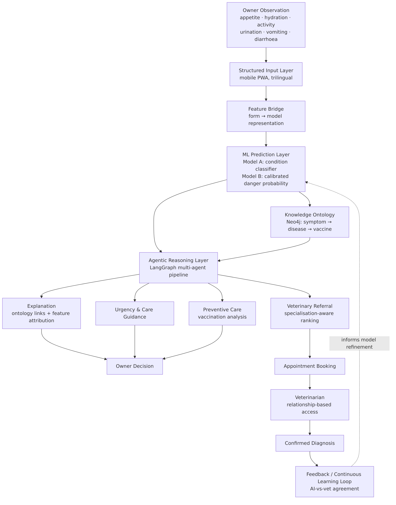
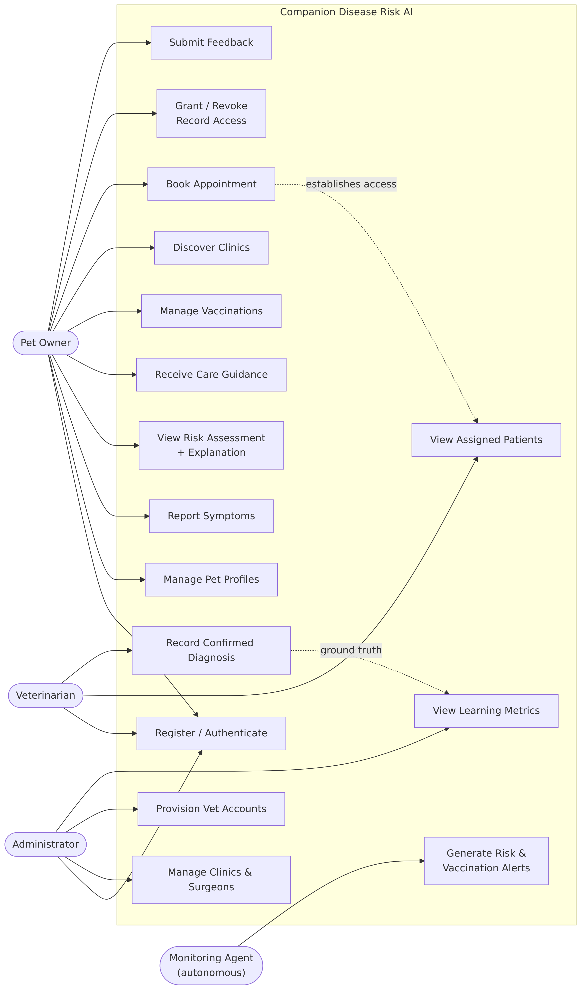
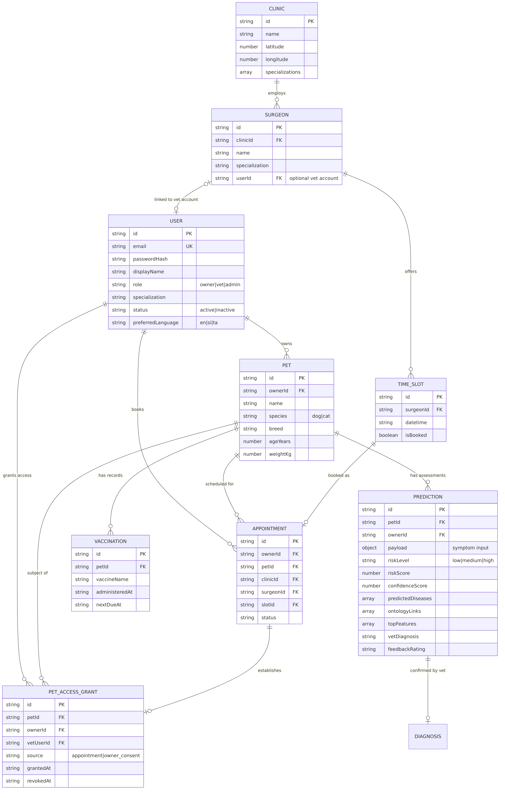
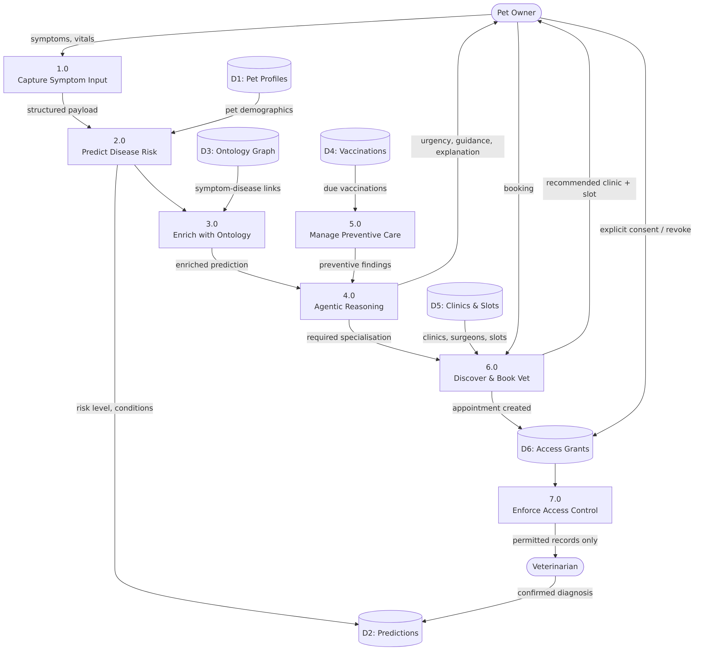
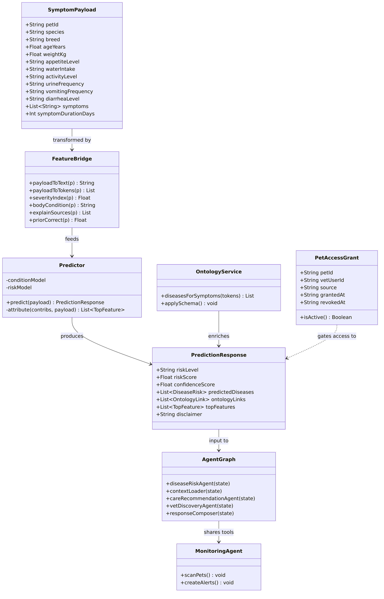
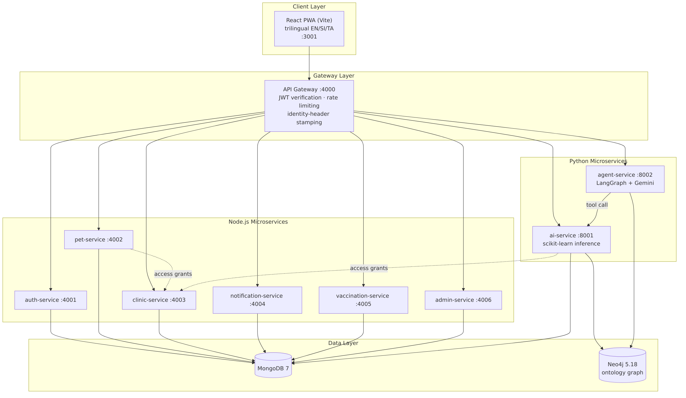
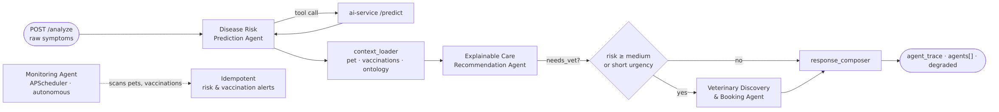
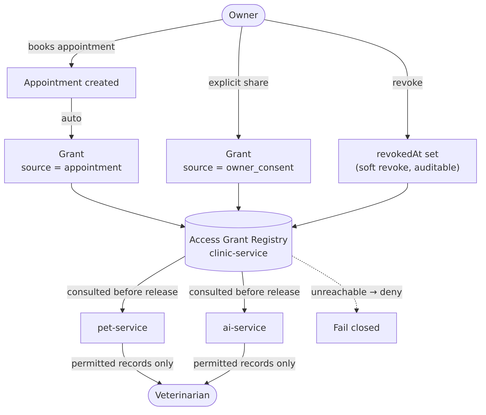
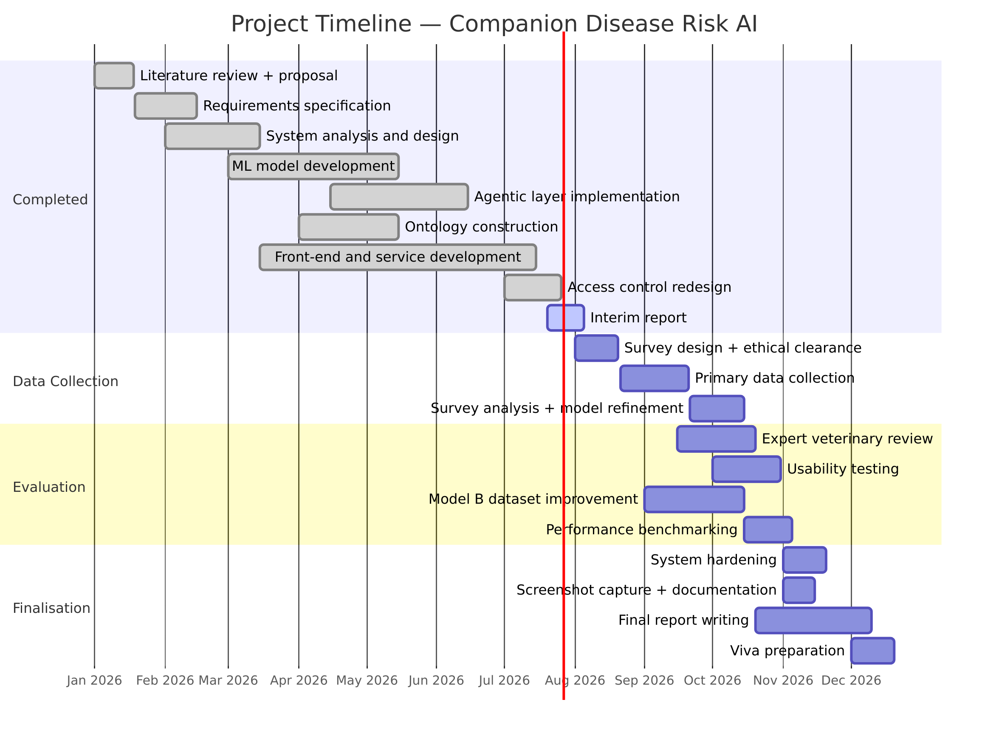

# Interim Report

---

## General Sir John Kotelawala Defence University
### Faculty of Computing
### Department of Information Technology

**IT42999 — Individual Research Project**

 

# Design and Evaluation of an Agentic AI-Driven Decision Support System for Explainable Early Disease Risk Detection in Companion Animals

 

**Student Name:** MTE Ranasinghe

**Index Number:** D/BIT/23/0025

**Degree Programme:** BSc (Hons) in Information Technology

 

**Principal Supervisor:** Dr. (Mrs) N Wedasinghe
*Senior Lecturer, Faculty of Computing, Department of Information Technology*

**Co-Supervisor:** Mr. BGL Balasuriya
*Head of Capacity Development, Virtusa*

 

**Submission Date:** 30 July 2026

---

## Table of Contents

1. [Chapter 1: Introduction](#chapter-1-introduction)
   - 1.1 Background of the Study
   - 1.2 Problem Statement
   - 1.3 Research Aim
   - 1.4 Research Objectives
   - 1.5 Research Questions
   - 1.6 Scope of the Study
   - 1.7 Significance of the Study
2. [Chapter 2: Literature Review](#chapter-2-literature-review)
   - 2.1 Introduction
   - 2.2 Review of Related Studies
   - 2.3 Theoretical Background
   - 2.4 Existing Technologies and Systems
   - 2.5 Research Gap
   - 2.6 Conceptual Framework
   - 2.7 Chapter Summary
3. [Chapter 3: Research Methodology](#chapter-3-research-methodology)
   - 3.1 Introduction
   - 3.2 Research Design and System Diagrams
   - 3.3 Research Approach
   - 3.4 Data Collection Methods
   - 3.5 Sampling Technique and Sample Size
   - 3.6 Data Analysis Methods
   - 3.7 Tools and Technologies Used
   - 3.8 Ethical Considerations
   - 3.9 Chapter Summary
4. [Chapter 4: Progress to Date](#chapter-4-progress-to-date)
   - 4.1 Work Completed
   - 4.2 Current Findings
   - 4.3 Screenshots and Diagrams
   - 4.4 Challenges Encountered
   - 4.5 Solutions Implemented
5. [Chapter 5: Proposed Work Plan](#chapter-5-proposed-work-plan)
   - 5.1 Remaining Activities
   - 5.2 Timeline (Gantt Chart)
   - 5.3 Expected Deliverables
   - 5.4 Risk Management Plan
6. [Conclusion](#conclusion)
7. [References](#references)
8. [Appendices](#appendices)

---

### List of Figures

| Figure | Title | Section |
|---|---|---|
| Figure 1 | Conceptual Framework of the Proposed System | 2.6 |
| Figure 2 | Use Case Diagram | 3.2.1 |
| Figure 3 | Entity Relationship Diagram (ERD) | 3.2.2 |
| Figure 4 | Level-1 Data Flow Diagram (DFD) | 3.2.3 |
| Figure 5 | Class Diagram (Core Domain) | 3.2.4 |
| Figure 6 | System Architecture — Microservice Deployment | 3.2.5 |
| Figure 7 | Agentic AI Pipeline (LangGraph Orchestration) | 4.1.5 |
| Figure 8 | Relationship-Based Access Control Model | 4.1.5 |
| Figure 9 | Model A — Normalised Confusion Matrix | 4.2.1 |
| Figure 10 | Project Timeline (Gantt Chart) | 5.2 |

### List of Tables

| Table | Title | Section |
|---|---|---|
| Table 1 | Comparison of Existing Pet Health Applications vs Proposed System | 2.4 |
| Table 2 | Mapping of Research Objectives to Research Questions | 1.5 |
| Table 3 | Datasets Used for Model Training | 3.4 |
| Table 4 | Tools and Technologies | 3.7 |
| Table 5 | Microservice Inventory | 4.1.4 |
| Table 6 | Model A — Per-Class Performance | 4.2.1 |
| Table 7 | Model B — Performance and Imbalance Caveat | 4.2.2 |
| Table 8 | Knowledge Ontology Composition | 4.2.3 |
| Table 9 | Requirements Implementation Status | 4.2.5 |
| Table 10 | Test Coverage Summary | 4.2.6 |
| Table 11 | Challenges and Solutions | 4.5 |
| Table 12 | Remaining Activities | 5.1 |
| Table 13 | Risk Management Plan | 5.4 |
| Table 14 | Respondent and Animal Characteristics | 4.2.7 |
| Table 15 | Distribution of Owner-Reported Health Indicators | 4.2.7 |

### List of Abbreviations

| Abbreviation | Expansion |
|---|---|
| AI | Artificial Intelligence |
| API | Application Programming Interface |
| CNN | Convolutional Neural Network |
| CRUD | Create, Read, Update, Delete |
| DFD | Data Flow Diagram |
| DSR | Design Science Research |
| ERD | Entity Relationship Diagram |
| FR | Functional Requirement |
| JWT | JSON Web Token |
| KDU | General Sir John Kotelawala Defence University |
| LLM | Large Language Model |
| MFE | Micro-Frontend |
| ML | Machine Learning |
| NFR | Non-Functional Requirement |
| NLP | Natural Language Processing |
| PR-AUC | Area Under the Precision–Recall Curve |
| PWA | Progressive Web Application |
| RBAC | Role-Based Access Control |
| REST | Representational State Transfer |
| ROC-AUC | Area Under the Receiver Operating Characteristic Curve |
| SDLC | Software Development Life Cycle |
| TF-IDF | Term Frequency–Inverse Document Frequency |
| UI / UX | User Interface / User Experience |

---

# Chapter 1: Introduction

## 1.1 Background of the Study

Companion animals — principally dogs and cats — occupy an increasingly significant place in Sri Lankan households, both as sources of companionship and as dependents whose welfare rests entirely on their owners' vigilance. Unlike human patients, animals cannot articulate discomfort. Disease in companion animals therefore expresses itself indirectly, through gradual changes in appetite, water consumption, urination frequency, activity level, and elimination patterns.

These early indicators are precisely the ones that untrained observers are least equipped to interpret. A dog drinking noticeably more water and losing weight despite eating normally is displaying a textbook presentation of diabetes mellitus, yet to an owner this may read as unremarkable seasonal behaviour. By the time signs become unambiguous — collapse, jaundice, persistent vomiting — the underlying condition is frequently advanced, treatment is more invasive, outcomes are poorer, and costs are substantially higher.

The digital tools currently available to pet owners do little to close this interpretive gap. Existing applications largely provide static reference content, manual symptom checklists, or simple reminder scheduling. They do not reason over the owner's input, do not stratify risk, and do not take action on the owner's behalf. Advances in machine learning and, more recently, in agentic artificial intelligence — systems in which multiple specialised agents reason, use tools, and act autonomously toward a goal — offer a credible route to bridging that gap.

## 1.2 Problem Statement

> Companion animals often suffer from life-threatening diseases that show limited or non-specific symptoms in their early stages. Pet owners lack accessible tools to identify early disease risk based on observable behavioural and physical changes, resulting in delayed veterinary consultation and advanced disease progression.

Three deficiencies compound this problem:

1. **Interpretive deficiency.** Subtle changes in appetite, hydration, activity, and elimination are individually unremarkable and only meaningful in combination. Owners lack the clinical framework to combine them.
2. **Technological deficiency.** Existing digital pet health tools offer static information or manual checklists, lacking autonomous reasoning, real-time analysis, and actionable decision support.
3. **Continuity deficiency.** Current systems do not integrate preventive care functions such as vaccination tracking, nor do they connect risk awareness to real-time access to veterinary services, limiting their effectiveness in promoting timely intervention.

The absence of structured, intelligent risk assessment mechanisms reduces owner confidence and weakens the adoption of preventive practices.

## 1.3 Research Aim

> To develop an Agentic AI-driven decision support system for early disease risk detection in companion animals.

The system is positioned deliberately and consistently as **decision support, not diagnosis**. This distinction is not merely a legal disclaimer; it shapes the system's architecture, its user-facing language, and its evaluation criteria throughout.

## 1.4 Research Objectives

| # | Objective |
|---|---|
| **O1** | To identify early disease risk in companion animals using owner-observed symptoms and behavioural patterns. |
| **O2** | To develop and evaluate machine learning–based models for disease risk prediction. |
| **O3** | To implement an Agentic AI framework that autonomously reasons over risk levels and provides action guidance. |
| **O4** | To integrate location-based veterinary clinic and surgeon availability with real-time time-slot information. |
| **O5** | To design a vaccination management and reminder mechanism to support timely preventive care for companion animals. |

## 1.5 Research Questions

**RQ1.** To what extent can owner-observable symptoms and behavioural indicators, collected through a structured mobile interface, support reliable early disease risk stratification in dogs and cats?

**RQ2.** Which machine learning approaches yield acceptable predictive performance on owner-reported symptom data, and what are their limitations when trained on imbalanced or partially synthetic datasets?

**RQ3.** How can an agentic AI layer improve upon a single predictive model by autonomously reasoning over risk, generating explanations, and triggering preventive and referral actions?

**RQ4.** How can predictions be made *explainable* to a non-expert owner, such that the system builds appropriate trust without encouraging self-diagnosis?

**RQ5.** How can a decision support system enforce appropriate privacy and access control over sensitive animal health records shared between owners and veterinary professionals?

**Table 2 — Mapping of Research Objectives to Research Questions**

| Objective | Addressed by | Evaluation Method |
|---|---|---|
| O1 | RQ1 | Model performance on held-out symptom data; expert review sample |
| O2 | RQ2 | Accuracy, macro-F1, ROC-AUC, PR-AUC, calibration analysis |
| O3 | RQ3 | Agent trace inspection; degraded-mode behaviour; monitoring agent output |
| O4 | RQ3 | Functional testing of discovery, availability, and booking flows |
| O5 | RQ3 | Preventive-care agent behaviour; vaccination escalation logic |
| (cross-cutting) | RQ4 | Explainability artefacts: ontology links, feature attribution |
| (cross-cutting) | RQ5 | Access-control test matrix; role-scoped API verification |

> **Note.** RQ4 and RQ5 were formalised during the implementation phase. Explainability was present in the original proposal as an aspiration; access control emerged as a distinct research concern once multi-role data sharing was implemented. Both are discussed in Chapter 4.

## 1.6 Scope of the Study

**In scope**

- Species limited to **dogs and cats**.
- Input restricted to **owner-observable** symptoms, behaviours, and pet demographics — no laboratory values, imaging, or wearable sensor streams.
- Risk stratification into **low / medium / high** with an associated confidence score, plus ranked candidate conditions.
- An **agentic layer** producing explanation, urgency assessment, preventive-care analysis, and veterinary referral.
- **Vaccination** record management and risk-aware reminders.
- **Location-based** veterinary discovery, surgeon availability, and appointment booking.
- A **trilingual** (English / Sinhala / Tamil), mobile-first, installable interface.

**Out of scope**

- Clinical diagnosis, prescription, or treatment planning.
- Species other than dogs and cats.
- Image-based diagnosis and IoT/wearable sensor integration.
- Integration with veterinary practice management systems or national animal health registries.
- Commercial deployment, payment processing, and telemedicine consultation.

## 1.7 Significance of the Study

- **Animal welfare.** Enhances early disease risk detection, supporting timely veterinary intervention and reducing the severity and cost of treatment through earlier awareness.
- **Owner empowerment.** Converts diffuse worry into a structured, explainable assessment with a clear recommended action, strengthening responsible pet ownership.
- **Methodological contribution.** Demonstrates the practical application of agentic AI to veterinary decision support, moving beyond single-model prediction toward multi-agent reasoning with autonomous action.
- **Explainability contribution.** Combines a curated knowledge ontology with model feature attribution, so that predictions are accompanied by reasons rather than presented as opaque outputs.
- **Local relevance.** A trilingual, offline-tolerant, low-cost digital health tool suited to Sri Lankan socio-economic and linguistic contexts, strengthening national capacity in applied AI and digital health innovation.

---

# Chapter 2: Literature Review

## 2.1 Introduction

This chapter reviews the current state of research at the intersection of machine learning, agentic artificial intelligence, and companion animal health. The review establishes what has been demonstrated, identifies the boundary of current capability, and locates the gap this project addresses. The reviewed literature spans quantitative health scoring, clinical visit classification, behavioural sensor fusion, conversational AI for pet owners, and broader surveys of AI in veterinary medicine.

## 2.2 Review of Related Studies

**Quantitative health scoring.** Kim and Kim [1] developed an AI-based health score system using sensor-collected behavioural data to quantitatively assess a dog's health status. The resulting score correlated highly with veterinary assessments (approximately 87.5% agreement), demonstrating a data-driven and owner-accessible health monitoring model. The present project extends this by integrating agentic reasoning to interpret risk patterns and trigger personalised alerts, rather than producing a score alone.

**Clinical visit classification.** Szlosek et al. [2] validated a machine learning model distinguishing preventive wellness visits from other veterinary visits using clinical records, achieving specificity of 0.94 and sensitivity of 0.86. This indicates real potential for subclinical disease identification during routine assessment. The present system adapts the concept to owner-reported rather than clinic-recorded data, moving detection earlier in the care pathway.

**Surveys of ML in animal health.** Das et al. [3] review machine learning techniques across animal health, highlighting persistent gaps in early detection and the need for real-time, accessible models. Bouchemla et al. [9] systematically review AI feasibility in veterinary medicine, identifying diagnostic and decision-support roles across haematology, imaging, and algorithmic support. Akinsulie et al. [16] survey potential applications across veterinary clinical practice and biomedical research. Collectively these establish decision support — as distinct from autonomous diagnosis — as the credible near-term application of AI in this domain.

**Conversational AI.** Jokar et al. [4] examine the opportunities and challenges of AI chatbots assisting pet owners with health information and decision-making. While not constituting a full decision support system, this work demonstrates that conversational interfaces can provide early guidance from described symptoms. The present project incorporates this capability but deliberately constrains it: the assistant *routes* users toward the structured assessment rather than predicting from free text, preserving a clean, evaluable prediction pipeline.

**Behavioural data and sensor fusion.** Aguilar-Lazcano et al. [5] provide a scoping review of machine learning–based sensor data fusion for animal monitoring, showing how behavioural data can be processed into health insight. This underpins the behavioural component of the present system's feature set, though the present work substitutes owner observation for instrumented sensing — a deliberate accessibility trade-off.

**Predictive modelling of specific conditions.** Imada et al. [6] compare tree-based algorithms for predicting future diagnostic test results, noting that such models function as predictive algorithms rather than standalone diagnostics — precisely the positioning adopted here. Rathi and Sumathi [8] review ML classification of pet diseases including diabetes, arthritis, and kidney disease, supporting the feasibility of multi-class risk estimation. Kulkarni et al. [15] propose an ML framework for animal disease prediction using environmental, behavioural, genetic, and historical data.

**Biomarkers and the early-signal problem.** Eman et al. [7] survey molecular biomarker discovery for animal disease, emphasising the central difficulty that clinical signs appear late. Although biomarkers are laboratory-centric and inaccessible to owners, this work reinforces the value of symptom and behavioural data as the only early signal available outside a clinical setting.

**Integrated assistance systems.** Aishwarya [10], [11] proposed PAWPAL, combining CNN-based image disease detection with NLP symptom analysis to deliver early guidance, achieving high accuracy on common skin conditions. Jin et al. [12] examine automated symptom extraction from clinical records for disease prediction, demonstrating reduced clinician workload. Shinde et al. [13] review AI in animal disease surveillance, prediction, and diagnosis, noting challenges of data quality and system reliability. Pereira et al. [14] overview AI in veterinary imaging.

## 2.3 Theoretical Background

**Design Science Research (DSR).** This project constructs and evaluates an artefact — a working system — as its primary research contribution. DSR provides the appropriate paradigm, framing the work as iterative build-and-evaluate cycles that generate design knowledge alongside a functioning system.

**Supervised classification.** Disease risk stratification is framed as a supervised learning problem. Text-derived features from structured symptom input are mapped to condition classes and to a binary danger indicator. Linear models are selected over deep architectures for interpretability, small artefact size, and CPU-only inference (NFR4).

**Class imbalance and probability calibration.** Where a training set is heavily skewed toward one class, an uncorrected classifier produces systematically inflated probabilities. Base-rate correction — shifting a probability from its training prior to a deployment prior — preserves ranking while decompressing absolute values. This is central to the honest use of Model B (Section 4.2.2).

**Knowledge representation via ontology.** A property graph of diseases, symptoms, vaccines, and weighted relationships supplies domain knowledge the statistical models do not contain, and provides a substrate for explanation independent of model internals.

**Agentic AI.** Distinct from a single model invocation, an agentic system decomposes a goal across specialised agents that reason, invoke tools, and act. Orchestration here is graph-based, with deterministic edges and conditional routing, rather than an open-ended autonomous loop — a choice that trades flexibility for reproducibility, which matters for academic evaluation.

**Explainable AI (XAI).** Two complementary mechanisms are employed: *knowledge-based* explanation (ontology links between reported symptoms and candidate conditions) and *model-based* explanation (per-prediction feature attribution). Neither alone is sufficient for a non-expert audience.

**Relationship-based access control.** Beyond conventional RBAC, access to health records is conditioned on an active care relationship between practitioner and patient, established through appointment or explicit owner consent — reflecting least-privilege and data-ownership principles from health informatics.

## 2.4 Existing Technologies and Systems

**Table 1 — Comparison of Existing Pet Health Applications vs Proposed System**

| Feature / Aspect | Existing Pet Health Applications | Proposed System |
|---|---|---|
| Symptom handling | Manual symptom checklists; limited behavioural analysis | Structured symptom and behavioural pattern analysis with intelligent interpretation |
| Disease risk prediction | Mostly descriptive information; no prediction | Machine learning–based early disease risk prediction |
| Use of AI | Basic rule-based or static logic | Agentic AI with autonomous reasoning, prioritisation, and action triggers |
| Preventive care | Reminders only | Intelligent preventive care agent (vaccination tracking, risk-aware reminders) |
| Decision support | General information only | Action-oriented support (risk alerts, recommendations, urgency assessment) |
| Behaviour monitoring | Usually missing or very limited | Multi-factor behaviour and symptom pattern analysis |
| User guidance | Generic advice | Personalised guidance based on risk level, pet profile, and detected patterns |
| System intelligence | Static; no autonomous action | Agentic layer generating alerts and recommendations without user prompts |
| Data sources | Single-type inputs | Hybrid: symptoms, behaviours, demographics, preventive health data |
| Veterinary support | Manual clinic search or static lists | Automated location-based discovery, surgeon availability, real-time slots |
| Explainability | Absent | Ontology-linked reasoning plus model feature attribution |
| Language support | Typically English only | Trilingual (English / Sinhala / Tamil) |

## 2.5 Research Gap

The reviewed literature establishes four consistent boundaries:

1. **Prediction without action.** Studies [1], [2], [6], [8] demonstrate predictive capability but terminate at the prediction. None autonomously assess urgency, generate preventive-care actions, or route the owner to appropriate care.
2. **Clinical data dependency.** Work such as [2] and [12] relies on clinical records or laboratory data, which by definition exist only *after* the owner has sought care — too late for the early-detection objective.
3. **Explainability treated as optional.** Surveys [9], [13] identify trust and reliability as adoption barriers, yet reviewed systems rarely surface *why* a prediction was made in terms a non-expert can act upon.
4. **Absence of care-pathway integration.** No reviewed system connects risk assessment to preventive scheduling and real-time veterinary availability within a single pathway.

> **Research Gap.** No existing system combines machine learning risk prediction from *owner-observable* data with an *agentic* reasoning layer that explains its output, assesses urgency, tracks preventive care, and routes the owner to a specific available veterinary professional — while enforcing privacy-preserving, relationship-based access to the resulting health records.

## 2.6 Conceptual Framework

**Figure 1 — Conceptual Framework of the Proposed System**

*Diagram source: `docs/diagrams/src/fig01-conceptual-framework.mmd`*

The framework is deliberately cyclical. The veterinarian's confirmed diagnosis returns to the system as ground truth, enabling measurement of real-world agreement — a signal distinct from offline test accuracy.

## 2.7 Chapter Summary

The literature confirms that machine learning can detect early disease signals in companion animals, and that decision support rather than autonomous diagnosis is the appropriate near-term application. It also confirms that current systems stop at prediction, depend on clinical data unavailable at the point of early detection, treat explainability as optional, and do not integrate risk assessment with the wider care pathway. This project addresses that combined gap through an agentic, explainable, care-integrated system operating on owner-observable data.

---

# Chapter 3: Research Methodology

## 3.1 Introduction

This chapter presents the research design, approach, data strategy, analytical methods, technologies, and ethical framework governing the study. The methodology follows the Design Science Research paradigm, in which the design, construction, and evaluation of a working artefact constitutes the primary contribution.

## 3.2 Research Design and System Diagrams

### 3.2.1 Use Case Diagram

**Figure 2 — Use Case Diagram**

*Diagram source: `docs/diagrams/src/fig02-use-case.mmd`*

### 3.2.2 Entity Relationship Diagram

**Figure 3 — Entity Relationship Diagram (ERD)**

*Diagram source: `docs/diagrams/src/fig03-erd.mmd`*

> The knowledge ontology (diseases, symptoms, vaccines and their weighted relationships) is held in a separate graph database and is therefore not represented in the relational ERD above; its composition is given in Table 8.

### 3.2.3 Data Flow Diagram

**Figure 4 — Level-1 Data Flow Diagram**

*Diagram source: `docs/diagrams/src/fig04-dfd.mmd`*

### 3.2.4 Class Diagram

**Figure 5 — Class Diagram (Core Domain)**

*Diagram source: `docs/diagrams/src/fig05-class.mmd`*

### 3.2.5 System Architecture

**Figure 6 — System Architecture (Microservice Deployment)**

*Diagram source: `docs/diagrams/src/fig06-architecture.mmd`*

## 3.3 Research Approach

The study follows a **Design Science Research** approach, as the primary objective is to design, develop, and evaluate an artefact. A **mixed-method** strategy is adopted:

- **Quantitative** methods train and evaluate machine learning models on structured symptom and behavioural data, reporting accuracy, macro-F1, ROC-AUC, PR-AUC, and calibration behaviour.
- **Qualitative** methods assess usability, trust, and practical effectiveness through user feedback and expert review.

System development follows an **iterative SDLC**, permitting continuous refinement in response to testing and feedback. Each iteration produces a working increment which is evaluated before the next design cycle begins.

## 3.4 Data Collection Methods

**Primary data.** A structured online survey of dog and cat owners has been administered, capturing observable symptoms (appetite, water intake, urination frequency, activity level, vomiting), vaccination status, health-seeking behaviour, and basic pet demographics. **Collection is ongoing: 31 valid responses have been received to date against a target of 100–150.** The current sample is therefore treated as a *preliminary* dataset suitable for descriptive characterisation and for validating the realism of the symptom vocabulary, but not yet sufficient for inferential analysis or for model retraining. Survey data does not inform the machine learning results reported in Chapter 4; the relationship between the two is discussed in Section 4.2.7.

**Secondary data.** Model training to date has used validated public datasets supplemented by knowledge-grounded synthetic generation.

**Table 3 — Datasets Used for Model Training**

| Dataset | Source | Size | Used For |
|---|---|---|---|
| Pet Health Symptoms | Hugging Face `karenwky/pet-health-symptoms-dataset` | 2,000 rows | Model A — 5 everyday condition classes |
| Template augmentation | Generated via the runtime feature bridge | 500 rows | Model A — closing the train/serve distribution gap |
| Knowledge-grounded chronic synthesis | Generated from documented clinical sign profiles | 2,700 rows | Model A — 6 chronic disease classes |
| Animal Condition Classification | Kaggle `willianoliveiragibin/animal-condition` | ~871 rows | Model B — danger probability |

> **Stated limitation.** The Hugging Face dataset is itself synthetically generated, and the chronic-disease rows are synthesised from documented clinical profiles. Reported per-class performance on these classes therefore measures pattern separability, not clinical diagnostic accuracy on real cases. This limitation is carried explicitly through Chapter 4.

## 3.5 Sampling Technique and Sample Size

**Survey sampling (in progress).** Non-probability **purposive sampling** targeting dog and cat owners in Sri Lanka, distributed through veterinary clinics, animal welfare organisations, and online pet-owner communities. Inclusion criterion: current owner of at least one dog or cat.

A target of **100–150 valid responses** was set as sufficient for descriptive characterisation of symptom prevalence and for validating the realism of the symptom vocabulary. **31 valid responses (approximately 21–31% of target) have been collected at the time of this report**, and collection continues.

The implications of the current sample size are stated plainly rather than minimised:

- The sample supports **descriptive** reporting of symptom prevalence and health-seeking behaviour, and is adequate for **face validation** of the symptom vocabulary — confirming that the attributes the system asks about are ones owners can actually observe and report.
- It is **not** sufficient for inferential statistics, subgroup comparison (for example dog versus cat owners), or model retraining, where a sample of this size would risk overfitting to idiosyncratic responses.
- Purposive, self-selecting online recruitment carries a **self-selection bias** toward more engaged and digitally literate owners, who are plausibly more attentive to their animals' health than the general population. This limits generalisability and is reported as a limitation rather than corrected for.

Continued collection is the highest-priority remaining activity (Section 5.1, A2).

**Expert review sampling (planned).** Purposive sampling of **3–5 practising veterinary surgeons** to review a stratified sample of system predictions. A prepared review instrument and answer key already exist (`docs/ml/expert_review_sample.csv`).

**Model evaluation sampling (completed).** Stratified 80/20 train–test split. Model A: 4,160 training / 1,040 test instances. Model B: 651 training / 218 test instances.

## 3.6 Data Analysis Methods

1. **Classification performance.** Accuracy, macro-F1, and per-class precision/recall/F1, with a confusion matrix. Macro-averaging is reported because class support is deliberately balanced across chronic classes and would otherwise mask minority-class weakness.
2. **Probability quality.** ROC-AUC and PR-AUC for the danger model, interpreted alongside prevalence, plus balanced accuracy to expose degenerate majority-class behaviour.
3. **Calibration analysis.** Sensitivity analysis of the base-rate correction, quantifying the trade-off between recovering "low risk" outputs on benign cases and retaining escalation on serious cases.
4. **Distributional validation.** Comparison of the rendered training text distribution against serve-time input to confirm the train/serve gap is closed.
5. **Knowledge-consistency validation.** Verification that predictions for symptom sets derived from ontology relationships recover the expected disease, testing agreement between the statistical and knowledge components.
6. **Real-world agreement.** AI-vs-veterinarian agreement rate computed from confirmed diagnoses — a measure distinct from, and more demanding than, offline test accuracy.
7. **Qualitative analysis.** Thematic analysis of usability feedback and expert commentary.

## 3.7 Tools and Technologies Used

**Table 4 — Tools and Technologies**

| Layer | Technology | Rationale |
|---|---|---|
| Front end | React 18, Vite, TypeScript, Tailwind CSS | Component model, fast builds, type safety |
| Mobile delivery | Progressive Web App (`vite-plugin-pwa`) | Installable and offline-tolerant without app-store dependency (NFR5) |
| Mapping | Leaflet + OpenStreetMap | Open, licence-free geospatial data |
| State / forms | Zustand, react-hook-form, Zod | Lightweight state; schema-validated input (FR2.4) |
| Backend (Node) | Node.js 20, Express, TypeScript | Mature ecosystem, shared language with front end |
| Backend (Python) | FastAPI, Python 3.11 | Native access to the scientific Python stack |
| Machine learning | scikit-learn 1.5, NumPy, pandas | Lightweight, interpretable, CPU-only inference (NFR4) |
| Agentic layer | LangGraph | Explicit graph orchestration with reproducible routing |
| Language model | Google Gemini (`gemini-flash-latest`) | Natural-language phrasing, with deterministic rule fallback |
| Scheduling | APScheduler | Background autonomous monitoring (FR4.4) |
| Databases | MongoDB 7, Neo4j 5.18 Community | Document store for records; property graph for the ontology |
| Authentication | JSON Web Tokens, bcrypt | Stateless auth with role claims (FR1.1, NFR2) |
| Orchestration | Docker, Docker Compose | Reproducible multi-service environment |
| Monorepo tooling | Turborepo, npm workspaces | Coordinated builds across services |
| Testing | pytest, Vitest, TypeScript compiler | Unit testing and static verification |
| Version control | Git / GitHub | Change history and traceability |

## 3.8 Ethical Considerations

The study involves animal health information supplied by human participants and is designed to minimise risk to both.

- **Non-diagnostic positioning (NFR1).** The system states persistently that it does not replace professional veterinary diagnosis. A disclaimer appears on every risk result, and no interface copy, agent output, or documentation presents results as a diagnosis.
- **Informed and voluntary participation.** Survey participation will be voluntary, with the purpose, data use, and withdrawal rights disclosed before consent.
- **Data minimisation and anonymity.** No sensitive personal information is collected. Research data is anonymised; analysis concerns pet health attributes, not identifiable owner characteristics.
- **Security.** Authentication uses bcrypt-hashed credentials and signed JWTs. The gateway verifies every token and stamps identity headers derived from the verified token, preventing client-supplied header spoofing.
- **Privacy by design.** Access to an animal's health records requires an active care relationship, established by appointment or explicit owner consent, and revocable by the owner at any time (Section 4.1.5).
- **Safety of guidance.** Where elevated risk is detected, the system directs the owner toward timely veterinary consultation rather than offering self-treatment guidance.
- **Environmental responsibility.** Lightweight models minimise computational and energy cost; broad device compatibility via PWA reduces hardware-upgrade pressure and electronic waste.

## 3.9 Chapter Summary

The study adopts Design Science Research with a mixed-method strategy and an iterative SDLC. System design is expressed through use case, entity relationship, data flow, class, and deployment models. Model evaluation to date rests on public and knowledge-grounded synthetic datasets. Primary survey collection is under way with 31 responses received against a 100–150 target, and expert veterinary review is scheduled in the remaining work plan. Ethical safeguards centre on non-diagnostic positioning, data minimisation, and relationship-based access control.

---

# Chapter 4: Progress to Date

## 4.1 Work Completed

### 4.1.1 Literature Review

A comprehensive review of sixteen peer-reviewed sources was completed and approved at the proposal stage, spanning quantitative health scoring, clinical visit classification, sensor fusion, conversational AI, biomarker discovery, and systematic reviews of AI in veterinary medicine. The review established the research gap presented in Section 2.5 and produced the comparative analysis in Table 1. This work is complete.

### 4.1.2 Requirement Gathering

Functional and non-functional requirements were formalised from the approved proposal into a structured specification (`docs/REQUIREMENTS.md`) comprising **eight functional requirement groups (FR1–FR8)** and **seven non-functional requirements (NFR1–NFR7)**. Each requirement is traceable to a proposal objective. This work is complete; requirements have been treated as a stable baseline throughout implementation.

### 4.1.3 System Analysis

System analysis produced the use case model (Figure 2), identifying four actors — pet owner, veterinarian, administrator, and an autonomous monitoring agent — and sixteen use cases. Analysis of data ownership across these actors identified a requirement not present in the original proposal: veterinarians must not have unrestricted access to all animal records. This finding drove the access control design in Section 4.1.5.

### 4.1.4 System Design

The system was designed as a **microservice architecture** behind an API gateway, with a React PWA client. Nine services are implemented and operational.

**Table 5 — Microservice Inventory**

| Service | Port | Responsibility |
|---|---|---|
| `api-gateway` | 4000 | JWT verification, rate limiting, identity-header stamping, request routing |
| `auth-service` | 4001 | Registration, login, JWT issuance, role normalisation, admin-provisioned vet accounts |
| `pet-service` | 4002 | Pet profile CRUD, ownership enforcement, grant-scoped veterinary access |
| `clinic-service` | 4003 | Clinics, surgeons, time slots, appointments, booking conflict checks, access grants |
| `notification-service` | 4004 | In-app notifications with deduplication idempotency |
| `vaccination-service` | 4005 | Vaccination records, due and overdue queries |
| `admin-service` | 4006 | Registration approvals, support tickets, append-only audit trail |
| `ai-service` | 8001 | Machine learning inference, prediction persistence, ontology application |
| `agent-service` | 8002 | LangGraph agent pipeline, autonomous monitoring agent |

Design decisions of note:

- **Gateway-enforced identity.** Services never trust client-supplied identity. The gateway strips and re-stamps `x-user-id` and `x-user-role` from the verified token, making header spoofing structurally impossible.
- **Shared feature bridge.** A single module renders the structured form into the model's input representation, used identically at training-augmentation time and at serve time, eliminating the train/serve distribution gap.
- **Graph-orchestrated agents.** Agent routing uses deterministic edges with a conditional branch, rather than open-ended autonomy, ensuring reproducible behaviour for evaluation.

### 4.1.5 Prototype Development

A working end-to-end prototype has been implemented and is operational across all nine services with both databases.

**Machine learning layer.** Two complementary models are blended with a deterministic severity index. Model A classifies the reported presentation into one of eleven conditions. Model B produces a calibrated probability that the presentation is dangerous. Full results appear in Section 4.2.

**Agentic layer.** A LangGraph pipeline orchestrates three agents plus a composer, with a fourth agent running autonomously in the background.

**Figure 7 — Agentic AI Pipeline (LangGraph Orchestration)**

*Diagram source: `docs/diagrams/src/fig07-agent-pipeline.mmd`*

Every response carries an `agent_trace`, a per-agent breakdown, and a `degraded` flag. Where the language model is unavailable or rate-limited, the entire layer degrades to deterministic rules and the interface displays a "Rule-based mode" badge, so the system never hard-fails.

**Explainability.** Two mechanisms are surfaced. Knowledge-based explanation presents ontology relationships between reported symptoms and candidate conditions. Model-based explanation presents per-prediction feature attributions, aggregated back onto the form fields the owner completed (Section 4.5).

**Feedback and continuous learning loop.** Owners rate each assessment as helpful or not helpful and indicate whether it matched their veterinarian's diagnosis. Veterinarians record the confirmed actual diagnosis. Both are stored on the prediction document, producing a clean prediction-versus-actual join from which an AI-vs-veterinarian agreement rate is computed.

**Relationship-based access control.** Analysis identified that veterinarians could initially read every pet record and every assessment in the system. This was redesigned around an explicit care relationship.

**Figure 8 — Relationship-Based Access Control Model**

*Diagram source: `docs/diagrams/src/fig08-access-control.mmd`*

The rule enforced is: *a veterinarian may read a pet's health information only while an active grant links them to that pet*. Grants arise from an appointment with that veterinarian — persisting beyond the visit to provide continuity of care for returning patients — or from explicit owner consent, revocable at any time. Revocation is soft, retaining the record so that access history remains auditable. Enforcement resides in the services rather than the interface, and fails closed: if the grant registry is unreachable, access is denied rather than granted.

## 4.2 Current Findings

### 4.2.1 Model A — Condition Classifier

**Pipeline.** TF-IDF vectorisation (1–2 grams) followed by logistic regression with balanced class weighting.
**Split.** 4,160 training / 1,040 test instances, stratified.
**Headline result.** Accuracy **0.903**, macro-F1 **0.908**.

**Table 6 — Model A Per-Class Performance**

| Class | Precision | Recall | F1 | Support | Data Origin |
|---|---|---|---|---|---|
| Diabetes Mellitus | 1.000 | 1.000 | **1.000** | 90 | Synthetic (knowledge-grounded) |
| Heart Disease | 1.000 | 1.000 | **1.000** | 90 | Synthetic |
| Liver Disease | 1.000 | 1.000 | **1.000** | 90 | Synthetic |
| Pancreatitis | 1.000 | 1.000 | **1.000** | 90 | Synthetic |
| Chronic Kidney Disease | 0.947 | 1.000 | **0.973** | 90 | Synthetic |
| Cancer | 1.000 | 0.944 | **0.971** | 90 | Synthetic |
| Digestive Issues | 0.890 | 0.848 | **0.868** | 105 | Real dataset |
| Mobility Problems | 0.748 | 0.883 | **0.810** | 94 | Real dataset |
| Ear Infections | 0.777 | 0.816 | **0.796** | 98 | Real dataset |
| Parasites | 0.831 | 0.763 | **0.796** | 97 | Real dataset |
| Skin Irritations | 0.804 | 0.736 | **0.768** | 106 | Real dataset |
| **Macro average** | **0.909** | **0.908** | **0.908** | 1,040 | — |

**Interpretation — stated honestly.** The headline figure is inflated by the six chronic classes, whose F1 scores of 0.971–1.000 reflect the separability of *synthetically encoded clinical patterns*, not diagnostic accuracy on real cases. The five classes derived from real data sit at **F1 0.768–0.868** and confuse with one another, particularly Skin Irritations with Ear Infections and Parasites — a clinically plausible confusion given overlapping presentations. The per-class breakdown, not the headline accuracy, is the appropriate figure to quote.

**Figure 9 — Model A Normalised Confusion Matrix** — see `docs/ml/condition_confusion_matrix.png`.

### 4.2.2 Model B — Danger Probability

**Pipeline.** Multi-label binarisation of symptom tokens, then logistic regression with balanced weighting wrapped in a calibrated classifier (sigmoid).
**Split.** 651 training / 218 test instances.

**Table 7 — Model B Performance and Imbalance Caveat**

| Metric | Value | Interpretation |
|---|---|---|
| ROC-AUC | 0.964 | The probability ranks dangerous above non-dangerous cases well |
| PR-AUC | 0.999 | **Inflated by prevalence** — not evidence of quality |
| Positive rate (training) | 0.977 | Severe class imbalance |
| Balanced accuracy | 0.500 | **Degenerate at the 0.5 threshold** |
| Recall (dangerous) | 1.000 | Predicts the majority class |
| Recall (not dangerous) | 0.000 | Fails entirely on the minority class |

**Interpretation and mitigation.** A dataset that is 97.7% "dangerous" means a constant classifier achieves 97% accuracy while learning nothing. Model B is therefore **never used as a hard label**. It contributes only a calibrated probability, which is first **prior-corrected** — shifting from the training prior of 0.977 to a neutral deployment prior of 0.5 — and then blended with a deterministic severity index derived from the reported vitals. Calibration sensitivity analysis showed this correction recovered approximately 59% "low risk" outputs on benign cases while retaining roughly 99% of serious chronic cases at medium risk or above, correcting a systematic over-triage tendency. This is reported as a documented limitation and a deliberate design response, not as a strength.

### 4.2.3 Knowledge Ontology

**Table 8 — Knowledge Ontology Composition**

| Element | Count |
|---|---|
| Disease nodes | 20 |
| Symptom nodes | 24 |
| Vaccine / preventive nodes | 8 |
| `INDICATES` relationships (symptom → disease, weighted) | 48 |
| `PREVENTS` relationships (vaccine → disease) | 12 |

Every node carries Sinhala and Tamil name properties alongside English. The schema is applied automatically and idempotently at `ai-service` startup. Symptom node names are maintained in exact correspondence with the model's checklist tokens and the front-end symptom identifiers; divergence between these three would silently degrade prediction quality rather than raise an error, so this correspondence is treated as an invariant.

### 4.2.4 Agentic Layer

Verified behaviour on a representative case (lethargy, anorexia, persistent vomiting, moderate diarrhoea, four days' duration):

- All three pipeline agents executed with `degraded: false`, confirming live language-model operation.
- `agent_trace` recorded the full path: disease risk prediction → context loader → explainable care recommendation → veterinary discovery → response composer.
- Required specialisation was correctly derived as *emergency care* from the predicted condition.
- Clinic ranking selected a recommended clinic and identified the matching surgeon with their next free slot.
- With the language model unavailable, the identical request returned rule-based output with `degraded: true`, confirming graceful degradation.

The autonomous monitoring agent was verified to scan pets and vaccination records, create risk and vaccination notifications, and correctly suppress duplicates on a second run within the same day.

### 4.2.5 Requirements Status

**Table 9 — Requirements Implementation Status**

| Requirement | Status | Evidence |
|---|---|---|
| FR1 — User & pet profile management | **Complete** | Three roles; ownership enforced from verified identity |
| FR2 — Symptom & behaviour collection | **Complete** | Structured vitals + checklist + duration + notes |
| FR3 — ML risk prediction | **Complete** | Two models; metrics in Tables 6 and 7 |
| FR4 — Agentic AI layer | **Complete** | Four agents; trace, per-agent breakdown, degraded flag |
| FR5 — Vaccination management | **Complete** | Persisted records; due/overdue queries; risk-aware escalation |
| FR6 — Veterinary discovery & booking | **Complete** | Haversine ranking, live OpenStreetMap results, slot booking with conflict checks |
| FR7 — Alerts & notifications | **Partial** | In-app notifications complete; push notification (FCM) out of scope |
| FR8 — Admin & vet functions | **Complete** | Clinic/surgeon/slot management; vet provisioning; learning metrics panel |
| NFR1 — Decision support, not diagnosis | **Complete** | Disclaimer on every result; verified across all copy |
| NFR2 — Security & privacy | **Complete** | JWT + bcrypt; gateway identity stamping; relationship-based access control |
| NFR3 — Usability | **Partial** | Mobile-first trilingual UI built; formal usability testing pending |
| NFR4 — Performance / efficiency | **Complete** | Model artefacts under 0.5 MB; CPU-only inference |
| NFR5 — Compatibility | **Complete** | Installable PWA |
| NFR6 — Reliability & maintenance | **Complete** | Automated tests; health checks; fail-closed authorisation |
| NFR7 — Evaluation | **Partial** | Model metrics complete; usability and expert evaluation pending |

### 4.2.6 Verification and Testing

**Table 10 — Test Coverage Summary**

| Suite | Tests | Coverage |
|---|---|---|
| `ai-service` (pytest) | 19 | Feature bridge mappings, prediction with models and fallback, history persistence |
| `agent-service` (pytest) | 15 | Rule ladder, degraded operation, graph routing, safety floor |
| `api-gateway` (Vitest) | 7 | JWT verification, public allowlist, enforcement on/off, header injection |
| Static verification | — | TypeScript strict-mode compilation across all workspaces |

Access control was verified through an explicit test matrix confirming that an ungranted veterinarian receives zero records on both list and direct-fetch endpoints; that a granted veterinarian receives exactly the permitted pet; that a *different* veterinarian remains denied throughout; that revocation immediately removes access; and that the owner's own view is unaffected in every case. Recording a diagnosis was confirmed to require an active grant.

### 4.2.7 Preliminary Survey Findings

The owner survey described in Section 3.4 has returned **31 valid responses**, all with recorded informed consent. Collection remains open. Analysis at this stage is descriptive; the sample is below the 100–150 target and no inferential claims are drawn from it. The raw response set is retained at `docs/survey/survey_responses.csv`.

**Table 14 — Respondent and Animal Characteristics (n = 31)**

| Attribute | Category | n | % |
|---|---|---|---|
| **Species** | Dog | 22 | 71.0 |
| | Cat | 9 | 29.0 |
| **Sex** | Male | 18 | 58.1 |
| | Female | 13 | 41.9 |
| **Age band** | Under 1 year | 1 | 3.3 |
| | 1–3 years | 10 | 33.3 |
| | 4–7 years | 16 | 53.3 |
| | 8 years and over | 3 | 10.0 |
| **Consent** | Given | 31 | 100.0 |

Age was reported as free text and parsed for 30 of 31 responses (mean 4.11 years, median 4.0, range 0.7–10.0). One respondent recorded *"No idea, he was old when I adopted him from nowhere"* — a rescue animal of unknown age. This is a meaningful design signal rather than a nuisance value: the system must accept an unknown age without blocking assessment, since a non-trivial proportion of Sri Lankan companion animals are adopted strays.

**Table 15 — Distribution of Owner-Reported Health Indicators (n = 31)**

| Indicator | Response | n | % |
|---|---|---|---|
| **Appetite** | Normal | 21 | 67.7 |
| | Slightly reduced | 10 | 32.3 |
| **Water intake** | Normal | 20 | 64.5 |
| | Increased | 6 | 19.4 |
| | Decreased | 5 | 16.1 |
| **Activity level** | Normal | 17 | 54.8 |
| | Slightly less active | 10 | 32.3 |
| | Very low activity | 4 | 12.9 |
| **Vomiting** | Occasional | 21 | 67.7 |
| | No | 10 | 32.3 |
| **Diarrhoea** *(item answered by 12 of 31)* | No | 7 | 22.6 |
| | Occasional | 5 | 16.1 |
| | Not answered | 19 | 61.3 |
| **Veterinary diagnosis** | Not diagnosed / not sure | 24 | 77.4 |
| | Chronic Kidney Disease | 4 | 12.9 |
| | Cancer | 1 | 3.2 |
| | Arthritis | 1 | 3.2 |
| | Injection allergies | 1 | 3.2 |

#### Findings

**F1 — The symptom vocabulary is answerable.** Every respondent completed every core indicator (appetite, water intake, activity, vomiting) using the supplied categories, with no free-text clarification requested. This satisfies the survey's primary purpose: confirming that the attributes the system asks about are ones owners can observe and report. The vocabulary requires no revision.

**F2 — Reported abnormality is high, and this must be interpreted with care.** Treating "Normal"/"No" as unremarkable, **26 of 31 respondents (83.9%) reported at least one abnormal indicator**, and 8 (25.8%) reported three or more. Two readings are possible and both carry consequences:

- *Self-selection.* Owners with a currently unwell animal are more motivated to complete a pet-health survey. This is the more likely explanation and reinforces the sampling limitation stated in Section 3.5.
- *Category sensitivity.* "Occasional" vomiting — reported by 67.7% — is common in clinically healthy cats and dogs, particularly in relation to grooming or diet. If owners read "Occasional" as encompassing entirely normal variation, the category may over-capture.

The second reading has a direct design implication: an input vocabulary that labels benign variation as abnormal will bias the severity index upward and contribute to over-triage. This finding therefore corroborates, from an independent direction, the over-triage tendency already identified statistically in Model B (Section 4.2.2) and mitigated through prior correction.

**F3 — Ranking of reported abnormalities.** Vomiting was the most frequently abnormal indicator (67.7%), followed by activity level (45.2%), water intake (35.5%), appetite (32.3%), and diarrhoea (16.1% of the full sample). The prominence of activity and appetite changes supports the emphasis these carry in the severity index.

**F4 — Response range was narrower than the instrument allowed.** No respondent selected the most severe option for appetite ("significantly reduced") or for vomiting ("frequent"). Observed responses cluster in the normal-to-mild range. A sample containing no severe presentations cannot validate the system's behaviour at the high-risk end of its scale, which remains dependent on synthetic and expert evaluation.

**F5 — The diagnosed subgroup is small but analytically instructive.** Seven respondents (22.6%) reported a veterinary-confirmed condition, four of them Chronic Kidney Disease. Examining owner-reported indicators against those diagnoses:

| Species | Diagnosis | Abnormal indicators reported |
|---|---|---|
| Cat | Chronic Kidney Disease | 4 — appetite, water intake, activity, vomiting |
| Dog | Chronic Kidney Disease | 4 — appetite, activity, vomiting, diarrhoea |
| Dog | Chronic Kidney Disease | 5 — appetite, water intake, activity, vomiting, diarrhoea |
| Dog | Chronic Kidney Disease | **0 — all indicators reported normal** |
| Cat | Cancer | 4 — appetite, water intake, activity, vomiting |
| Cat | Injection allergies | 3 — water intake, activity, vomiting |
| Dog | Arthritis | 2 — activity, vomiting |

Three of the four CKD cases presented multiple abnormal indicators, and the cat case showed increased water intake with very low activity — consistent with the polydipsia and lethargy characteristic of the condition, and with the `INDICATES` weights encoded in the ontology (Section 4.2.3).

**The fourth CKD case reported every indicator as normal.** This single response is the most valuable observation in the dataset. It is a direct, real-world instance of the central limitation of owner-observable data: a confirmed chronic condition that presents no signal the owner can perceive. No amount of model refinement can detect what the input channel does not carry. This is precisely why the system is positioned as decision support rather than diagnosis, why the disclaimer requirement (NFR1) is non-negotiable, and why a "low risk" output must never be presented as reassurance that the animal is well. The final report will cite this case explicitly when discussing limitations.

**F6 — Instrument defect identified.** The diarrhoea item was answered by only 12 of 31 respondents (38.7%). Inspection of response timestamps shows all 19 missing values occur in responses submitted before 10 January 2026 22:02, and every response after that point contains an answer. This indicates the item was added or made visible partway through collection rather than being skipped by respondents. Consequently, diarrhoea prevalence cannot be reported for the full sample and the 16.1% figure above is computed over the whole sample rather than over those who saw the question (5 of 12, or 41.7%, among respondents who were asked).

#### Role of the survey within the research design

It is worth stating precisely what this survey does and does not contribute, since its role is easily misread:

1. **Face validation of the symptom vocabulary (primary purpose).** Achieved — see F1.
2. **Empirical support for the problem statement.** Partially achieved. The 22.6% diagnosed rate and the CKD case with no observable signs support the premise that early disease is difficult for owners to detect. However, the deployed instrument does **not** ask how long owners waited before consulting a veterinarian, so health-seeking delay — a central claim in Section 1.2 — remains unquantified by primary data.
3. **Language and adoption preferences.** Not captured. The deployed instrument omits the technology-use and language-preference sections described in the planned design, so the trilingual interface priority remains justified by context rather than by respondent data.
4. **What it does *not* do.** The survey is **not** a training data source. Owner-reported symptom sets carry no veterinary-confirmed label for the majority of responses, and the seven that do are far too few to supervise an eleven-class classifier. Model training rests on the datasets in Table 3; the route to label-bearing real-world data is the feedback loop in Section 4.1.5.

Points 2 and 3 identify a gap between the planned and deployed instruments. Extending the questionnaire with health-seeking delay, vaccination awareness, and language preference items is recorded as Activity A2b in Section 5.1, to be applied to the remaining collection.

This distinction matters for the evaluation narrative: a larger survey improves the *justification* and *usability grounding* of the system, whereas improved *predictive validity* depends on expert review (Activity A4) and on accumulated veterinarian-confirmed diagnoses.

## 4.3 Screenshots and Diagrams

Diagrams are embedded throughout this chapter (Figures 6–8) and Chapter 3 (Figures 2–6). The Model A confusion matrix is available at `docs/ml/condition_confusion_matrix.png`.

Interface screenshots to be captured for the final report are listed in Appendix E, covering: owner dashboard, symptom reporting flow, risk result with explanation panels, agent guidance, clinic map and booking, vaccination history, veterinarian patient view, and the administrator governance panel.

## 4.4 Challenges Encountered

**C1 — Severe class imbalance in the danger dataset.** The Kaggle dataset is 97.7% positive, producing a model with zero minority-class recall and a systematic tendency to over-triage benign presentations as dangerous.

**C2 — Train/serve distribution gap.** The application collects structured form data, whereas the source dataset consists of free text. A model trained on one and served the other would degrade silently.

**C3 — Fragmented and unreadable feature attribution.** TF-IDF over a rendered sentence decomposes a single owner answer into several overlapping n-grams. One answer — "drinking less water" — surfaced as four separate entries ("less", "drinking less", "less water", "water is") plus template connectives such as "has". This misrepresented one finding as four independent pieces of evidence and was unintelligible to a non-expert.

**C4 — Service startup race condition.** The Neo4j container requires approximately 70 seconds to expose its Bolt interface. The AI service applies the ontology once at startup and was reaching the database before it was ready, leaving the graph silently empty — disabling explanation without producing any error.

**C5 — Over-permissioned veterinary access.** The initial design allowed any authenticated veterinarian to read every pet profile and every AI assessment on the platform, which is inappropriate for health-adjacent data.

**C6 — Fabricated data in the interface.** Several elements displayed invented values: fixed star ratings and review counts for clinics despite no review feature existing; a hardcoded vaccination reminder shown regardless of records; a fixed symptom list displayed when none were reported; and a fabricated confidence value during offline operation.

**C7 — Unauthenticated internal requests.** Three administrative interface calls omitted the bearer token, so with authentication enforcement enabled they failed silently — leaving governance panels blank and preventing delivery of credentials to newly provisioned veterinarians.

## 4.5 Solutions Implemented

**Table 11 — Challenges and Solutions**

| # | Challenge | Solution Implemented | Outcome |
|---|---|---|---|
| C1 | Danger-model imbalance | Bayesian base-rate correction from training prior 0.977 to deployment prior 0.5; probability blended with a deterministic severity index; hard label never used | ~59% "low risk" recovered on benign cases; ~99% of serious cases retained at ≥ medium |
| C2 | Train/serve gap | Single shared feature bridge used identically for training augmentation and serve-time rendering | Distribution gap closed; validated in `distributional_validation.json` |
| C3 | Fragmented attribution | N-grams mapped back to the originating form field and contributions summed per field (valid for a linear model); unmappable template fragments discarded; stored predictions re-attributed on read | "less / drinking less / less water / water is / has" became "Water intake: increased" and "Appetite: reduced" |
| C4 | Startup race | Container health check probing the Bolt interface and authentication, gating dependent service startup | Ontology now applies reliably on cold start; verified across restarts |
| C5 | Over-permissioned access | Relationship-based access control with appointment and consent grants, enforced in services, failing closed | Ungranted veterinarian access reduced from all records to zero; verified by test matrix |
| C6 | Fabricated data | Ratings removed from schema, seed and interface; demo seeding made opt-in; empty states replace invented values; offline confidence suppressed in both interface and exported reports | No fabricated values remain in any user-facing surface |
| C7 | Unauthenticated calls | Routed through the authenticated API client used elsewhere in the application | Governance panels and credential delivery restored |

Two of these solutions constitute methodological contributions rather than mere defect repairs. The attribution aggregation in C3 addresses a general weakness of TF-IDF explainability for form-derived text, and the access model in C5 formalises a privacy property that the original proposal did not specify.

---

# Chapter 5: Proposed Work Plan

## 5.1 Remaining Activities

**Table 12 — Remaining Activities**

| ID | Activity | Description | Priority |
|---|---|---|---|
| A1 | ~~Survey instrument design~~ — **complete** | Questionnaire designed and deployed; 31 responses received | Done |
| A2 | **Continue survey collection** | Extend distribution to reach 100–150 responses; currently at 31. Widen channels: veterinary clinics, welfare organisations, university networks, pet-owner groups | High |
| A2b | **Extend the questionnaire** | Add the health-seeking delay, vaccination awareness, and language preference items identified as missing in Section 4.2.7; repair the diarrhoea item so it is presented to all respondents | High |
| A3 | Survey re-analysis | Re-run descriptive analysis on the enlarged sample; test whether the 83.9% abnormality rate persists or reflects early self-selection | High |
| A4 | Expert veterinary review | Distribute the prepared review sample to 3–5 practising surgeons; analyse agreement | High |
| A5 | Formal usability testing | Task-based evaluation with representative owners; System Usability Scale administration | High |
| A6 | Model B dataset improvement | Source or construct a better-balanced danger dataset to address the imbalance limitation | Medium |
| A7 | Interface screenshot capture | Systematic capture of all flows for the final report | Medium |
| A8 | Push notification integration | Evaluate feasibility of completing FR7.2 within scope | Low |
| A9 | Performance benchmarking | Inference latency, end-to-end response time, resource consumption | Medium |
| A10 | Final system hardening | Security review, error-handling audit, deployment configuration | Medium |
| A11 | Final report writing | Full dissertation incorporating all evaluation results | High |
| A12 | Viva preparation | Demonstration script, anticipated questions, contribution defence | High |

## 5.2 Timeline (Gantt Chart)

**Figure 10 — Project Timeline**

*Diagram source: `docs/diagrams/src/fig10-gantt.mmd`*

> **Note.** The schedule beyond the interim submission is indicative and should be reconciled against the official departmental deadlines for final submission and viva.

## 5.3 Expected Deliverables

1. A fully functional Agentic AI decision support system for companion animal health monitoring, delivered as an installable progressive web application.
2. An agentic symptom and behaviour analysis module for early disease risk detection.
3. Machine learning classification models for early risk of selected high-impact diseases, with documented evaluation.
4. An autonomous health-monitoring agent performing continuous evaluation without user prompting.
5. A preventive-care agent tracking vaccination timelines and generating risk-aware alerts.
6. A vaccination reminder system integrated with disease risk analysis.
7. Real-time location-based veterinary clinic discovery with surgeon availability and consultation slots.
8. A risk-based alert and guidance system recommending timely veterinary consultation.
9. Secure user and pet profile management with relationship-based access control.
10. An explainability subsystem combining ontology-based and model-based explanation.
11. A feedback and continuous-learning loop reporting AI-versus-veterinarian agreement.
12. A research report documenting methodology, experimental results, and evaluation.
13. Performance evaluation and usability testing results.
14. System documentation and user guidelines.

## 5.4 Risk Management Plan

**Table 13 — Risk Management Plan**

| ID | Risk | Likelihood | Impact | Mitigation |
|---|---|---|---|---|
| R1 | Insufficient survey responses within the collection window | Medium | Medium | Distribute through multiple channels (clinics, welfare organisations, online communities); the system does not depend on survey data for core function, so a shortfall degrades validation depth rather than blocking delivery |
| R2 | Difficulty recruiting veterinary experts for review | Medium | High | Review instrument and answer key already prepared to minimise expert time; approach supervisors' professional networks; reduce to three reviewers if necessary |
| R3 | No better-balanced danger dataset obtainable | Medium | Medium | Current mitigation (prior correction plus severity blending) is already documented and defensible; the limitation would be reported honestly rather than concealed |
| R4 | Language model API quota, cost, or availability limits | Low | Low | Deterministic rule-based fallback already implemented and tested; the system degrades rather than fails |
| R5 | Synthetic training data undermines claims of clinical validity | High | Medium | Already mitigated by reporting per-class results separately and stating the limitation explicitly; expert review (A4) provides independent evidence |
| R6 | Scope expansion during evaluation | Medium | Medium | Requirements baseline frozen; FR7.2 already classified as out of scope; new findings recorded as future work |
| R7 | Data loss or environment failure | Low | High | Source code version-controlled on GitHub; environment fully reproducible via Docker Compose; model artefacts committed |
| R8 | Time pressure from concurrent academic commitments | Medium | High | Evaluation activities scheduled in parallel where independent; final report drafting begins before evaluation concludes |

---

# Conclusion

## Summary of Progress

The project has progressed from an approved proposal to a fully operational prototype implementing all five research objectives. The literature review, requirements specification, system analysis, and system design are complete. The prototype comprises nine microservices, two machine learning models, a four-agent AI layer, a trilingual progressive web interface, and a knowledge ontology of twenty diseases, twenty-four symptoms, and sixty weighted relationships.

## Achievements to Date

1. **Working end-to-end system.** All five proposal objectives are implemented and demonstrable, from symptom capture through risk prediction, explanation, preventive-care analysis, and veterinary referral to appointment booking.
2. **Evaluated machine learning models.** Model A achieves accuracy 0.903 and macro-F1 0.908 across eleven classes, with per-class results reported separately for synthetic and real-data classes. Model B's imbalance limitation is quantified, mitigated through base-rate correction, and reported transparently rather than concealed.
3. **Genuine agentic behaviour.** A LangGraph pipeline of three agents with conditional routing, plus a fourth autonomous monitoring agent, verified operating in both live and degraded modes.
4. **Explainability by construction.** Ontology-linked reasoning and model feature attribution, with attribution redesigned to express itself in terms of the owner's own answers rather than model-internal n-grams.
5. **Closed feedback loop.** Owner feedback and veterinarian-confirmed diagnoses combine into an AI-versus-veterinarian agreement metric, providing a real-world accuracy signal distinct from offline test performance.
6. **Privacy-preserving access control.** A relationship-based model restricting veterinary access to animals with an active care relationship, enforced at the service layer and failing closed.
7. **Verified integrity of presentation.** A systematic audit removed all fabricated data from user-facing surfaces, ensuring that every displayed value derives from real system state.

## Next Steps

Immediate priorities are extending survey collection from the current 31 responses toward the 100–150 target, and securing expert veterinary review. These provide the independent validation the project currently lacks: the machine learning results reported here derive from public and knowledge-grounded synthetic datasets, and while the system's *behaviour* is verified, its *clinical plausibility* has not yet been assessed by practitioners. Formal usability testing will address NFR3 and NFR7, and improving the danger-model dataset remains the most valuable technical refinement available.

The project is on schedule, with the substantial engineering risk now retired and the remaining work concentrated in evaluation and documentation.

---

# References

[1] S. C. Kim and S. Kim, "Development of a Dog Health Score Using an Artificial Intelligence Disease Prediction Algorithm Based on Multifaceted Data," *Animals*, vol. 14, no. 2, Jan. 2024, doi: 10.3390/ani14020256.

[2] D. Szlosek, M. Coyne, J. Riggott, K. Knight, D. J. McCrann, and D. Kincaid, "Development and validation of a machine learning model for clinical wellness visit classification in cats and dogs," *Front. Vet. Sci.*, vol. 11, 2024, doi: 10.3389/fvets.2024.1348162.

[3] S. Das, R. K. Roy, and T. Bezboruah, "Machine Learning in Animal Healthcare: A Comprehensive Review," *International Journal of Recent Engineering Science*, vol. 11, no. 3, pp. 89–93, Jun. 2024, doi: 10.14445/23497157/ijres-v11i3p109.

[4] M. Jokar, A. Abdous, and V. Rahmanian, "AI chatbots in pet health care: Opportunities and challenges for owners," John Wiley and Sons Inc., May 2024, doi: 10.1002/vms3.1464.

[5] C. A. Aguilar-Lazcano, I. E. Espinosa-Curiel, J. A. Ríos-Martínez, F. A. Madera-Ramírez, and H. Pérez-Espinosa, "Machine Learning-Based Sensor Data Fusion for Animal Monitoring: Scoping Review," MDPI, Jun. 2023, doi: 10.3390/s23125732.

[6] J. Imada, J. C. Arango-Sabogal, C. Bauman, S. Roche, and D. Kelton, "Comparison of Machine Learning Tree-Based Algorithms to Predict Future Paratuberculosis ELISA Results Using Repeat Milk Tests," *Animals*, vol. 14, no. 7, Apr. 2024, doi: 10.3390/ani14071113.

[7] S. Eman et al., "Technologies in Biomarker Discovery for Animal Diseases: Mechanisms, Classification, and Diagnostic Applications," Multidisciplinary Digital Publishing Institute (MDPI), Nov. 2025, doi: 10.3390/ani15213132.

[8] J. Rathi and A. Sumathi, "Animal Health Prediction Using Hybrid KNN Based Vector Neighbor Classification Model: A Machine Learning Approach," *Journal of Computer Science*, vol. 21, no. 9, pp. 2088–2095, Sep. 2025, doi: 10.3844/jcssp.2025.2088.2095.

[9] F. Bouchemla, S. V. Akchurin, I. V. Akchurina, G. P. Dyulger, E. S. Latynina, and A. V. Grecheneva, "Artificial intelligence feasibility in veterinary medicine: A systematic review," *Vet. World*, vol. 16, no. 10, pp. 2143–2149, 2023, doi: 10.14202/vetworld.2023.2143-2149.

[10] A. AP, "PAWPAL: AI-Based Pet Health Assistance System Using Image-based Disease Detection and NLP Symptom Analysis," *Int. J. Res. Appl. Sci. Eng. Technol.*, vol. 13, no. 12, pp. 2065–2072, Dec. 2025, doi: 10.22214/ijraset.2025.76461.

[11] A. AP, "PAWPAL: AI-Based Pet Health Assistance System Using Image-based Disease Detection and NLP Symptom Analysis," *Int. J. Res. Appl. Sci. Eng. Technol.*, vol. 13, no. 12, pp. 2065–2072, Dec. 2025, doi: 10.22214/ijraset.2025.76461.

[12] Y.-G. Jin et al., "AI Veterinary Assistance: Enhancing Clinical Decision-making in Animal Healthcare," *IEEE Access*, doi: 10.1109/ACCESS.2024.0429000.

[13] O. Shinde, S. Sankpal, Y. Kandalkar, T. Bhosale, and S. Khairnar, "Emerging role of artificial intelligence in animal disease surveillance, prediction and diagnosis: A Review," *International Journal of Veterinary Sciences and Animal Husbandry*, vol. 10, no. 10S, pp. 41–45, Jan. 2025, doi: 10.22271/veterinary.2025.v10.i10Sa.2623.

[14] A. I. Pereira et al., "Artificial Intelligence in Veterinary Imaging: An Overview," MDPI, May 2023, doi: 10.3390/vetsci10050320.

[15] P. P. P. Kulkarni, K. Jay, K. Pratik, and I. Kshitij, "Animal Disease Prediction Using Machine Learning," 2025.

[16] O. C. Akinsulie et al., "The potential application of artificial intelligence in veterinary clinical practice and biomedical research," *Front. Vet. Sci.*, vol. 11, 2024, doi: 10.3389/fvets.2024.1347550.

> **Note.** References [10] and [11] are duplicate entries carried forward from the approved proposal. These should be merged and the in-text citations renumbered before final submission.

---

# Appendices

## Appendix A — Survey Questionnaire

### A.1 Instrument as deployed

The following items were administered and produced the 31 responses analysed in Section 4.2.7. Raw responses are retained at `docs/survey/survey_responses.csv`.

| # | Item | Response options |
|---|---|---|
| 1 | Consent — *"This survey is conducted for academic research purposes only. It does not provide medical diagnosis or veterinary advice. I voluntarily agree to participate."* | Yes, I agree |
| 2 | Pet type | Dog / Cat |
| 3 | Pet age | Free text |
| 4 | Pet gender | Male / Female |
| 5 | Compared to normal, how was your pet's appetite? | Normal / Slightly reduced / Significantly reduced |
| 6 | Have you noticed any change in your pet's water consumption? | Normal / Increased / Decreased |
| 7 | How would you describe your pet's activity level? | Normal / Slightly less active / Very low activity |
| 8 | Has your pet experienced vomiting? | No / Occasional / Frequent |
| 9 | Has your pet experienced diarrhoea? | No / Occasional / Frequent |
| 10 | Has your pet been diagnosed by a qualified veterinarian with any of the following conditions? | Condition list / Not diagnosed / Not sure |

**Known issues with the deployed instrument** (identified in Section 4.2.7 and addressed by Activity A2b):

- Item 9 (diarrhoea) was not presented to the first 19 respondents and is answered by only 12 of 31.
- Item 3 (age) is free text, producing values such as *"1year and 6month old"* and *"No idea"* that require manual parsing. A structured age band with an explicit "unknown" option is preferable.
- The instrument does not capture urination frequency, although this is a core system input and a primary indicator for kidney and metabolic conditions.

### A.2 Proposed additional items for continued collection

To be added under Activity A2b:

**Health-seeking behaviour:** typical delay between noticing a change and consulting a veterinarian; factors influencing that decision. *(Required to substantiate the delay claim in Section 1.2 with primary data.)*

**Preventive care:** vaccination status; awareness of the next due date; current reminder practices.

**Technology use:** existing use of any pet health application; barriers to adoption.

**Language preference:** English / Sinhala / Tamil. *(Required to substantiate the trilingual design decision with respondent data.)*

**Urination frequency:** normal / increased / reduced, to align the instrument with the system's actual input set.

## Appendix B — Expert Review Instrument

A stratified sample of system predictions with a corresponding answer key has been prepared for veterinary expert review at `docs/ml/expert_review_sample.csv` and `docs/ml/expert_review_answer_key.csv`. Reviewers assess whether the predicted condition ranking and assigned urgency are clinically reasonable for the presented symptom set.

## Appendix C — Gantt Chart

See Figure 10, Section 5.2.

## Appendix D — Validation Artefacts

| Artefact | Path | Purpose |
|---|---|---|
| Model A metrics | `backend/services/python/ai-service/app/models/condition_metrics.json` | Per-class precision, recall, F1, confusion matrix |
| Model B metrics | `backend/services/python/ai-service/app/models/risk_metrics.json` | ROC-AUC, PR-AUC, imbalance caveat |
| Confusion matrix plot | `docs/ml/condition_confusion_matrix.png` | Figure 9 |
| Distributional validation | `docs/ml/distributional_validation.json` | Train/serve gap verification |
| Knowledge consistency | `docs/ml/knowledge_consistency_validation.json` | Ontology–model agreement |
| Calibration experiment | `docs/ml/risk_calibration_experiment.json` | Prior-correction sensitivity analysis |
| ML methodology | `docs/ml/README.md` | Dataset provenance, pipeline detail, limitations |
| Requirements specification | `docs/REQUIREMENTS.md` | FR1–FR8, NFR1–NFR7 |
| Verification guide | `docs/VERIFICATION.md` | Reproducible end-to-end verification procedure |

## Appendix E — Interface Screenshots

*To be captured (Activity A7).* Planned coverage:

1. Onboarding and role selection
2. Owner dashboard with health overview
3. Pet profile with vaccination history and record-sharing controls
4. Symptom reporting flow
5. Risk result — risk badge, confidence, predicted conditions
6. Explanation panels — knowledge-base links and influencing factors
7. Agent guidance — urgency, recommendations, recommended clinic
8. Clinic map with distance-ranked results
9. Appointment booking and slot selection
10. Veterinarian patient list and diagnosis recording
11. Administrator governance panel with learning metrics
12. Trilingual interface demonstration (English / Sinhala / Tamil)

## Appendix F — Code Repository

Source code, commit history, and reproducible environment configuration are maintained at:
`https://github.com/UserTharushi/companion-disease-risk-ai`

The complete system can be reproduced with `docker compose up --build` from the project root. Verification procedures are documented in `docs/VERIFICATION.md`.

## Appendix G — Meeting Minutes

*To be compiled from supervision records.*

## Appendix H — Ethical Approval Documents

*Departmental ethical approval documentation to be attached.* The survey instrument carries an explicit consent statement recorded against every response (Appendix A.1, item 1), and all 31 respondents recorded consent. The ethical framework governing the study is set out in Section 3.8.
